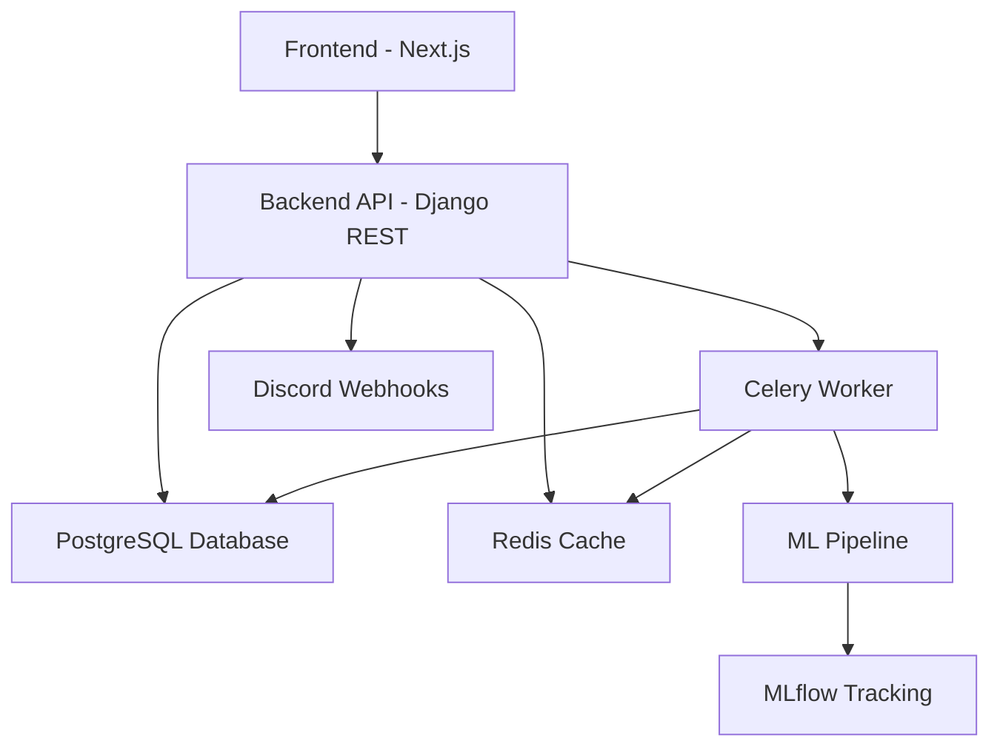
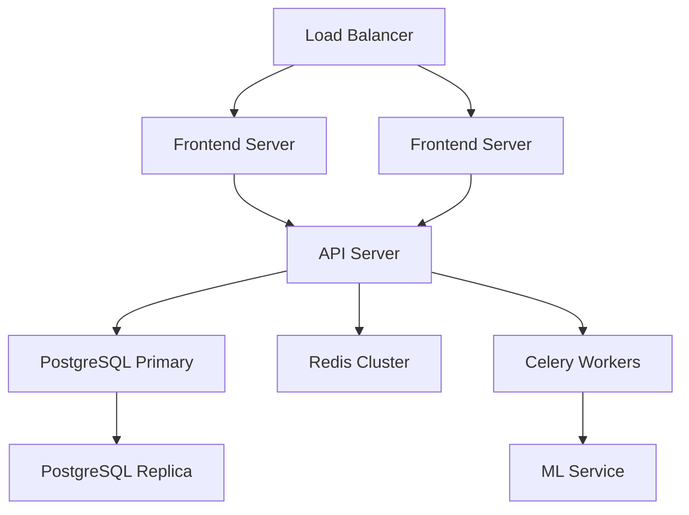

# Architecture Overview

## System Architecture



## Components

### Frontend Layer
- **Technology**: Next.js 13+ with App Router
- **Key Features**:
  - Server-side rendering for performance
  - TypeScript for type safety
  - Tailwind CSS for styling
  - Shadcn UI components
  - Real-time updates via API polling
  - Client-side caching
  - Responsive design

### API Layer
- **Technology**: Django REST Framework
- **Key Features**:
  - RESTful API endpoints
  - JWT authentication
  - Role-based access control
  - Request validation
  - Rate limiting
  - Error handling
  - API documentation

### Database Layer
- **Technology**: PostgreSQL
- **Schema**:
  - Customer data
  - Risk history
  - Alert configurations
  - User management
  - Model metadata

### Caching Layer
- **Technology**: Redis
- **Usage**:
  - API response caching
  - Session management
  - Rate limiting
  - Task queue backend

### Task Processing
- **Technology**: Celery
- **Tasks**:
  - Model training
  - Batch predictions
  - Risk monitoring
  - Alert processing
  - Data import/export

### ML Pipeline
- **Technology**: Scikit-learn
- **Components**:
  - Data preprocessing
  - Feature engineering
  - Model training
  - Model evaluation
  - Prediction serving

### Monitoring
- **Technology**: MLflow
- **Tracking**:
  - Model metrics
  - Training runs
  - Parameters
  - Artifacts

### Alert System
- **Technology**: Discord Webhooks
- **Features**:
  - Real-time alerts
  - Risk notifications
  - System status updates
  - Error reporting

## Data Flow

1. **Customer Data Input**:
   ```mermaid
   sequenceDiagram
       participant U as User
       participant F as Frontend
       participant A as API
       participant D as Database
       
       U->>F: Input customer data
       F->>A: POST /api/customers/
       A->>D: Save customer
       D-->>A: Confirm save
       A-->>F: Return customer data
       F-->>U: Show confirmation
   ```

2. **Prediction Flow**:
   ```mermaid
   sequenceDiagram
       participant F as Frontend
       participant A as API
       participant C as Cache
       participant M as ML Model
       participant D as Database
       
       F->>A: Request prediction
       A->>C: Check cache
       alt Cache hit
           C-->>A: Return cached result
       else Cache miss
           A->>M: Make prediction
           M-->>A: Return result
           A->>D: Save prediction
           A->>C: Cache result
       end
       A-->>F: Return prediction
   ```

3. **Alert Flow**:
   ```mermaid
   sequenceDiagram
       participant M as Monitoring
       participant Q as Task Queue
       participant A as Alert System
       participant D as Discord
       participant DB as Database
       
       M->>Q: Trigger alert
       Q->>A: Process alert
       A->>D: Send webhook
       A->>DB: Log alert
       D-->>A: Confirm delivery
       A-->>Q: Complete task
   ```

## Security Architecture

1. **Authentication**:
   - JWT tokens for API authentication
   - Secure token storage
   - Token refresh mechanism
   - Session management

2. **Authorization**:
   - Role-based access control
   - Permission checking
   - Resource ownership validation
   - API endpoint protection

3. **Data Security**:
   - HTTPS encryption
   - Database encryption
   - Input sanitization
   - XSS protection
   - CSRF protection

4. **Rate Limiting**:
   - API rate limiting
   - Failed login attempt limiting
   - Webhook rate limiting
   - Cache-based throttling

## Deployment Architecture



## Scalability Considerations

1. **Horizontal Scaling**:
   - Stateless API servers
   - Load balanced frontend
   - Read replicas for database
   - Distributed caching
   - Worker pool scaling

2. **Performance Optimization**:
   - Response caching
   - Database indexing
   - Query optimization
   - Batch processing
   - Asynchronous tasks

3. **High Availability**:
   - Database replication
   - Cache redundancy
   - Service redundancy
   - Automated failover
   - Health monitoring 