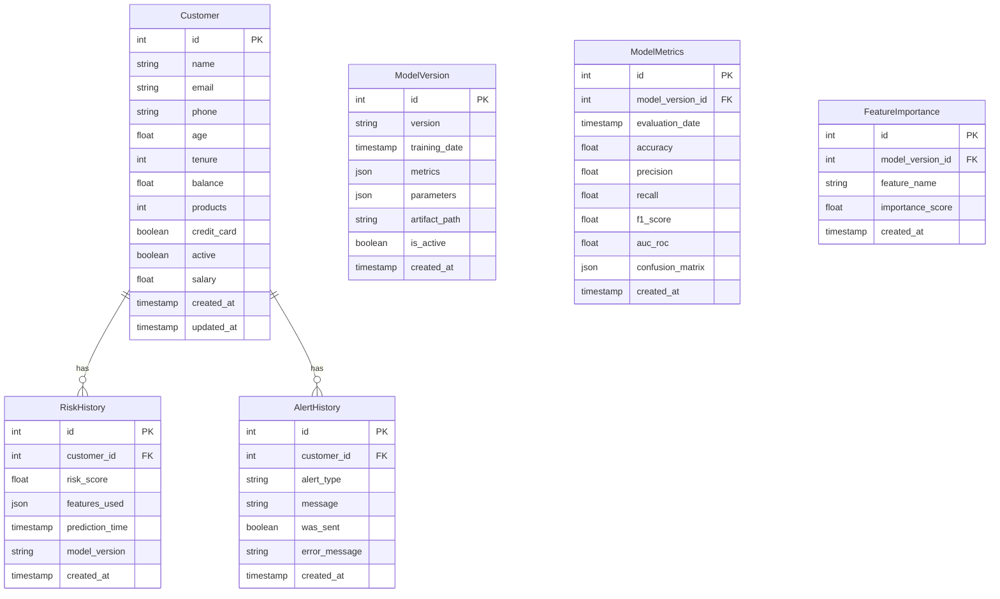

# Database Schema Documentation

## Overview

The application uses PostgreSQL as its primary database. This document outlines the database schema, including tables, relationships, and indexes.

## Entity Relationship Diagram



## Tables

### Customer

Stores customer information and features used for churn prediction.

```sql
CREATE TABLE customer (
    id SERIAL PRIMARY KEY,
    name VARCHAR(255) NOT NULL,
    email VARCHAR(255) UNIQUE NOT NULL,
    phone VARCHAR(50),
    age FLOAT,
    tenure INTEGER,
    balance FLOAT,
    products INTEGER,
    credit_card BOOLEAN,
    active BOOLEAN,
    salary FLOAT,
    created_at TIMESTAMP WITH TIME ZONE DEFAULT CURRENT_TIMESTAMP,
    updated_at TIMESTAMP WITH TIME ZONE DEFAULT CURRENT_TIMESTAMP
);

-- Indexes
CREATE INDEX idx_customer_email ON customer(email);
CREATE INDEX idx_customer_created_at ON customer(created_at);
CREATE INDEX idx_customer_updated_at ON customer(updated_at);
```

### RiskHistory

Tracks the history of risk predictions for each customer.

```sql
CREATE TABLE risk_history (
    id SERIAL PRIMARY KEY,
    customer_id INTEGER REFERENCES customer(id) ON DELETE CASCADE,
    risk_score FLOAT NOT NULL,
    features_used JSONB NOT NULL,
    prediction_time TIMESTAMP WITH TIME ZONE NOT NULL,
    model_version VARCHAR(50) NOT NULL,
    created_at TIMESTAMP WITH TIME ZONE DEFAULT CURRENT_TIMESTAMP
);

-- Indexes
CREATE INDEX idx_risk_history_customer ON risk_history(customer_id);
CREATE INDEX idx_risk_history_prediction_time ON risk_history(prediction_time);
CREATE INDEX idx_risk_history_risk_score ON risk_history(risk_score);
```

### AlertHistory

Records all alerts generated for customers.

```sql
CREATE TABLE alert_history (
    id SERIAL PRIMARY KEY,
    customer_id INTEGER REFERENCES customer(id) ON DELETE CASCADE,
    alert_type VARCHAR(50) NOT NULL,
    message TEXT NOT NULL,
    was_sent BOOLEAN DEFAULT FALSE,
    error_message TEXT,
    created_at TIMESTAMP WITH TIME ZONE DEFAULT CURRENT_TIMESTAMP
);

-- Indexes
CREATE INDEX idx_alert_history_customer ON alert_history(customer_id);
CREATE INDEX idx_alert_history_created_at ON alert_history(created_at);
CREATE INDEX idx_alert_history_alert_type ON alert_history(alert_type);
```

### ModelVersion

Tracks different versions of the ML model.

```sql
CREATE TABLE model_version (
    id SERIAL PRIMARY KEY,
    version VARCHAR(50) UNIQUE NOT NULL,
    training_date TIMESTAMP WITH TIME ZONE NOT NULL,
    metrics JSONB NOT NULL,
    parameters JSONB NOT NULL,
    artifact_path VARCHAR(255) NOT NULL,
    is_active BOOLEAN DEFAULT FALSE,
    created_at TIMESTAMP WITH TIME ZONE DEFAULT CURRENT_TIMESTAMP
);

-- Indexes
CREATE INDEX idx_model_version_version ON model_version(version);
CREATE INDEX idx_model_version_is_active ON model_version(is_active);
```

### ModelMetrics

Stores detailed metrics for each model version.

```sql
CREATE TABLE model_metrics (
    id SERIAL PRIMARY KEY,
    model_version_id INTEGER REFERENCES model_version(id) ON DELETE CASCADE,
    evaluation_date TIMESTAMP WITH TIME ZONE NOT NULL,
    accuracy FLOAT NOT NULL,
    precision FLOAT NOT NULL,
    recall FLOAT NOT NULL,
    f1_score FLOAT NOT NULL,
    auc_roc FLOAT NOT NULL,
    confusion_matrix JSONB NOT NULL,
    created_at TIMESTAMP WITH TIME ZONE DEFAULT CURRENT_TIMESTAMP
);

-- Indexes
CREATE INDEX idx_model_metrics_model_version ON model_metrics(model_version_id);
CREATE INDEX idx_model_metrics_evaluation_date ON model_metrics(evaluation_date);
```

### FeatureImportance

Records feature importance scores for each model version.

```sql
CREATE TABLE feature_importance (
    id SERIAL PRIMARY KEY,
    model_version_id INTEGER REFERENCES model_version(id) ON DELETE CASCADE,
    feature_name VARCHAR(100) NOT NULL,
    importance_score FLOAT NOT NULL,
    created_at TIMESTAMP WITH TIME ZONE DEFAULT CURRENT_TIMESTAMP
);

-- Indexes
CREATE INDEX idx_feature_importance_model_version ON feature_importance(model_version_id);
CREATE INDEX idx_feature_importance_score ON feature_importance(importance_score);
```

## Views

### HighRiskCustomers

A materialized view that identifies high-risk customers based on their latest predictions.

```sql
CREATE MATERIALIZED VIEW high_risk_customers AS
SELECT 
    c.id,
    c.name,
    c.email,
    rh.risk_score,
    rh.prediction_time
FROM customer c
JOIN (
    SELECT DISTINCT ON (customer_id)
        customer_id,
        risk_score,
        prediction_time
    FROM risk_history
    ORDER BY customer_id, prediction_time DESC
) rh ON c.id = rh.customer_id
WHERE rh.risk_score >= 0.7
WITH DATA;

-- Indexes
CREATE UNIQUE INDEX idx_high_risk_customers_id ON high_risk_customers(id);
CREATE INDEX idx_high_risk_customers_risk_score ON high_risk_customers(risk_score);
```

### RiskTrends

A view that calculates daily risk trends.

```sql
CREATE VIEW risk_trends AS
SELECT 
    DATE(prediction_time) as date,
    COUNT(*) as total_predictions,
    AVG(risk_score) as average_risk,
    COUNT(*) FILTER (WHERE risk_score >= 0.7) as high_risk_count
FROM risk_history
GROUP BY DATE(prediction_time)
ORDER BY date DESC;
```

## Functions

### UpdateCustomerRisk

A function to update customer risk scores and create alerts if necessary.

```sql
CREATE OR REPLACE FUNCTION update_customer_risk()
RETURNS TRIGGER AS $$
BEGIN
    -- Update customer's last risk assessment
    UPDATE customer
    SET updated_at = NEW.prediction_time
    WHERE id = NEW.customer_id;

    -- Create alert for high-risk customers
    IF NEW.risk_score >= 0.7 THEN
        INSERT INTO alert_history (
            customer_id,
            alert_type,
            message
        ) VALUES (
            NEW.customer_id,
            'HIGH_RISK',
            format('Customer %s has a high churn risk of %.2f', NEW.customer_id, NEW.risk_score)
        );
    END IF;

    RETURN NEW;
END;
$$ LANGUAGE plpgsql;

-- Trigger
CREATE TRIGGER trigger_update_customer_risk
AFTER INSERT ON risk_history
FOR EACH ROW
EXECUTE FUNCTION update_customer_risk();
```

## Maintenance

### Partitioning

The `risk_history` table is partitioned by month to improve query performance:

```sql
-- Create partitioned table
CREATE TABLE risk_history (
    id SERIAL,
    customer_id INTEGER,
    risk_score FLOAT,
    features_used JSONB,
    prediction_time TIMESTAMP WITH TIME ZONE,
    model_version VARCHAR(50),
    created_at TIMESTAMP WITH TIME ZONE DEFAULT CURRENT_TIMESTAMP
) PARTITION BY RANGE (prediction_time);

-- Create monthly partitions
CREATE TABLE risk_history_y2024m01 PARTITION OF risk_history
    FOR VALUES FROM ('2024-01-01') TO ('2024-02-01');

-- Function to create future partitions
CREATE OR REPLACE FUNCTION create_risk_history_partition()
RETURNS void AS $$
DECLARE
    next_month DATE;
BEGIN
    next_month := date_trunc('month', now()) + interval '1 month';
    
    EXECUTE format(
        'CREATE TABLE IF NOT EXISTS risk_history_y%sm%s PARTITION OF risk_history
         FOR VALUES FROM (%L) TO (%L)',
        to_char(next_month, 'YYYY'),
        to_char(next_month, 'MM'),
        next_month,
        next_month + interval '1 month'
    );
END;
$$ LANGUAGE plpgsql; 