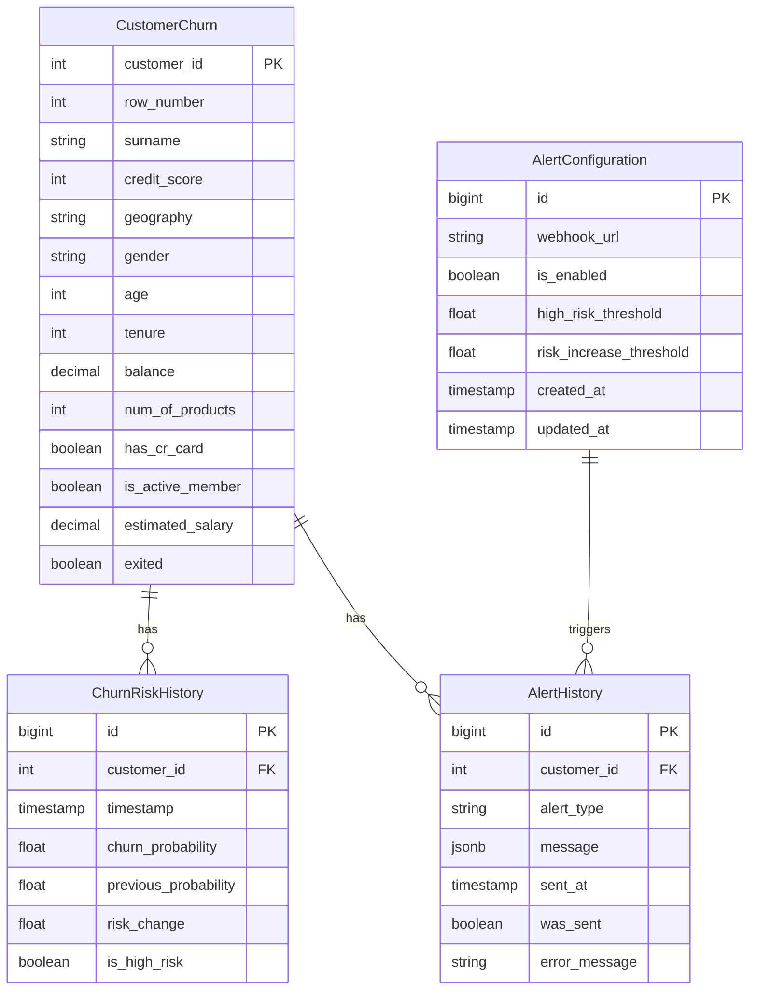

# Database Schema Design

## Overview
This document details the database schema for the Customer Churn Prediction System. The schema is designed to efficiently store and manage customer data, risk predictions, alerts, and model metrics.

## MERISE Representation

### MCD (Conceptual Data Model)
```mermaid
erDiagram
    CUSTOMER_CHURN ||--o{ CHURN_RISK_HISTORY : has
    CUSTOMER_CHURN ||--o{ ALERT_HISTORY : generates
    ALERT_CONFIGURATION ||--o{ ALERT_HISTORY : triggers

    CUSTOMER_CHURN {
        customer_id PRIMARY_KEY
        row_number
        surname
        credit_score
        geography
        gender
        age
        tenure
        balance
        num_of_products
        has_cr_card
        is_active_member
        estimated_salary
        exited
    }

    CHURN_RISK_HISTORY {
        id PRIMARY_KEY
        customer_id FOREIGN_KEY
        timestamp
        churn_probability
        previous_probability
        risk_change
        is_high_risk
    }

    ALERT_CONFIGURATION {
        id PRIMARY_KEY
        webhook_url
        is_enabled
        high_risk_threshold
        risk_increase_threshold
        created_at
        updated_at
    }

    ALERT_HISTORY {
        id PRIMARY_KEY
        customer_id FOREIGN_KEY
        alert_type
        message
        sent_at
        was_sent
        error_message
    }
```

### MLD (Logical Data Model)
```
CUSTOMER_CHURN (
    #customer_id: INT,
    row_number: INT,
    surname: VARCHAR(50),
    credit_score: INT,
    geography: VARCHAR(50),
    gender: VARCHAR(10),
    age: INT,
    tenure: INT,
    balance: DECIMAL(15,2),
    num_of_products: INT,
    has_cr_card: BOOLEAN,
    is_active_member: BOOLEAN,
    estimated_salary: DECIMAL(15,2),
    exited: BOOLEAN
)

CHURN_RISK_HISTORY (
    #id: BIGINT,
    customer_id: INT => CUSTOMER_CHURN(customer_id),
    timestamp: TIMESTAMP,
    churn_probability: FLOAT,
    previous_probability: FLOAT,
    risk_change: FLOAT,
    is_high_risk: BOOLEAN
)

ALERT_CONFIGURATION (
    #id: BIGINT,
    webhook_url: VARCHAR(500),
    is_enabled: BOOLEAN,
    high_risk_threshold: FLOAT,
    risk_increase_threshold: FLOAT,
    created_at: TIMESTAMP,
    updated_at: TIMESTAMP
)

ALERT_HISTORY (
    #id: BIGINT,
    customer_id: INT => CUSTOMER_CHURN(customer_id),
    alert_type: VARCHAR(20),
    message: JSONB,
    sent_at: TIMESTAMP,
    was_sent: BOOLEAN,
    error_message: TEXT
)
```

### MPD (Physical Data Model)
[Previous SQL CREATE TABLE statements remain the same...]

## Asynchronous Flow Diagrams

### 1. Customer Data Flow


### 2. Prediction Flow


### 3. Alert Flow


## Entity Relationship Diagram



## Table Definitions

### 1. CustomerChurn

Primary table storing customer information and churn status.

```sql
CREATE TABLE customer_churn (
    customer_id INTEGER PRIMARY KEY,
    row_number INTEGER,
    surname VARCHAR(50),
    credit_score INTEGER,
    geography VARCHAR(50),
    gender VARCHAR(10),
    age INTEGER,
    tenure INTEGER,
    balance DECIMAL(15,2),
    num_of_products INTEGER,
    has_cr_card BOOLEAN DEFAULT FALSE,
    is_active_member BOOLEAN DEFAULT FALSE,
    estimated_salary DECIMAL(15,2),
    exited BOOLEAN DEFAULT FALSE
);

-- Indexes
CREATE INDEX idx_customer_credit_score ON customer_churn(credit_score);
CREATE INDEX idx_customer_geography ON customer_churn(geography);
CREATE INDEX idx_customer_age ON customer_churn(age);
CREATE INDEX idx_customer_tenure ON customer_churn(tenure);
CREATE INDEX idx_customer_exited ON customer_churn(exited);
```

### 2. ChurnRiskHistory

Tracks historical risk predictions for each customer.

```sql
CREATE TABLE churn_risk_history (
    id BIGSERIAL PRIMARY KEY,
    customer_id INTEGER REFERENCES customer_churn(customer_id) ON DELETE CASCADE,
    timestamp TIMESTAMP WITH TIME ZONE DEFAULT CURRENT_TIMESTAMP,
    churn_probability FLOAT NOT NULL,
    previous_probability FLOAT,
    risk_change FLOAT,
    is_high_risk BOOLEAN DEFAULT FALSE,
    CONSTRAINT chk_probability_range CHECK (churn_probability >= 0 AND churn_probability <= 1)
);

-- Indexes
CREATE INDEX idx_risk_history_customer ON churn_risk_history(customer_id);
CREATE INDEX idx_risk_history_timestamp ON churn_risk_history(timestamp);
CREATE INDEX idx_risk_history_is_high_risk ON churn_risk_history(is_high_risk);
```

### 3. AlertConfiguration

Stores Discord webhook configuration and alert thresholds.

```sql
CREATE TABLE alert_configuration (
    id BIGSERIAL PRIMARY KEY,
    webhook_url VARCHAR(500) NOT NULL,
    is_enabled BOOLEAN DEFAULT TRUE,
    high_risk_threshold FLOAT DEFAULT 0.7,
    risk_increase_threshold FLOAT DEFAULT 20.0,
    created_at TIMESTAMP WITH TIME ZONE DEFAULT CURRENT_TIMESTAMP,
    updated_at TIMESTAMP WITH TIME ZONE DEFAULT CURRENT_TIMESTAMP,
    CONSTRAINT chk_threshold_range CHECK (
        high_risk_threshold >= 0 AND 
        high_risk_threshold <= 1 AND 
        risk_increase_threshold >= 0
    )
);

-- Indexes
CREATE INDEX idx_alert_config_is_enabled ON alert_configuration(is_enabled);
```

### 4. AlertHistory

Records all alerts sent through the system.

```sql
CREATE TABLE alert_history (
    id BIGSERIAL PRIMARY KEY,
    customer_id INTEGER REFERENCES customer_churn(customer_id),
    alert_type VARCHAR(20) CHECK (alert_type IN ('HIGH_RISK', 'RISK_INCREASE', 'SUMMARY')),
    message JSONB NOT NULL,
    sent_at TIMESTAMP WITH TIME ZONE DEFAULT CURRENT_TIMESTAMP,
    was_sent BOOLEAN DEFAULT FALSE,
    error_message TEXT,
    CONSTRAINT fk_customer FOREIGN KEY (customer_id) 
        REFERENCES customer_churn(customer_id) ON DELETE SET NULL
);

-- Indexes
CREATE INDEX idx_alert_history_customer ON alert_history(customer_id);
CREATE INDEX idx_alert_history_type ON alert_history(alert_type);
CREATE INDEX idx_alert_history_sent_at ON alert_history(sent_at);
CREATE INDEX idx_alert_history_was_sent ON alert_history(was_sent);
```

## Views

### 1. High Risk Customers View

```sql
CREATE OR REPLACE VIEW high_risk_customers AS
SELECT 
    c.*,
    rh.churn_probability,
    rh.timestamp as last_prediction
FROM customer_churn c
JOIN (
    SELECT DISTINCT ON (customer_id)
        customer_id,
        churn_probability,
        timestamp
    FROM churn_risk_history
    ORDER BY customer_id, timestamp DESC
) rh ON c.customer_id = rh.customer_id
WHERE rh.churn_probability >= (
    SELECT high_risk_threshold 
    FROM alert_configuration 
    WHERE is_enabled = true 
    LIMIT 1
);
```

### 2. Risk Trend View

```sql
CREATE OR REPLACE VIEW risk_trends AS
SELECT 
    DATE(timestamp) as date,
    COUNT(*) as total_predictions,
    AVG(churn_probability) as avg_risk_score,
    COUNT(*) FILTER (WHERE is_high_risk) as high_risk_count
FROM churn_risk_history
GROUP BY DATE(timestamp)
ORDER BY date DESC;
```

## Functions and Triggers

### 1. Update Risk History Trigger

```sql
CREATE OR REPLACE FUNCTION update_risk_history()
RETURNS TRIGGER AS $$
BEGIN
    -- Calculate risk change
    NEW.risk_change := CASE 
        WHEN NEW.previous_probability IS NOT NULL 
        THEN ((NEW.churn_probability - NEW.previous_probability) / NEW.previous_probability) * 100
        ELSE NULL
    END;
    
    -- Determine if high risk based on current threshold
    SELECT NEW.churn_probability >= high_risk_threshold
    INTO NEW.is_high_risk
    FROM alert_configuration
    WHERE is_enabled = true
    LIMIT 1;
    
    RETURN NEW;
END;
$$ LANGUAGE plpgsql;

CREATE TRIGGER trg_update_risk_history
BEFORE INSERT ON churn_risk_history
FOR EACH ROW
EXECUTE FUNCTION update_risk_history();
```

### 2. Update Alert Configuration Timestamp

```sql
CREATE OR REPLACE FUNCTION update_alert_config_timestamp()
RETURNS TRIGGER AS $$
BEGIN
    NEW.updated_at = CURRENT_TIMESTAMP;
    RETURN NEW;
END;
$$ LANGUAGE plpgsql;

CREATE TRIGGER trg_update_alert_config_timestamp
BEFORE UPDATE ON alert_configuration
FOR EACH ROW
EXECUTE FUNCTION update_alert_config_timestamp();
```

## Maintenance

### 1. Partitioning Strategy

The `churn_risk_history` table is partitioned by month to improve query performance:

```sql
-- Create partitioned table
CREATE TABLE churn_risk_history (
    id BIGSERIAL,
    customer_id INTEGER,
    timestamp TIMESTAMP WITH TIME ZONE,
    churn_probability FLOAT,
    previous_probability FLOAT,
    risk_change FLOAT,
    is_high_risk BOOLEAN
) PARTITION BY RANGE (timestamp);

-- Create monthly partitions
CREATE TABLE churn_risk_history_y2024m01 PARTITION OF churn_risk_history
    FOR VALUES FROM ('2024-01-01') TO ('2024-02-01');
```

### 2. Cleanup Function

```sql
CREATE OR REPLACE FUNCTION cleanup_old_data()
RETURNS void AS $$
BEGIN
    -- Delete risk history older than 1 year
    DELETE FROM churn_risk_history
    WHERE timestamp < NOW() - INTERVAL '1 year';
    
    -- Delete alert history older than 6 months
    DELETE FROM alert_history
    WHERE sent_at < NOW() - INTERVAL '6 months';
END;
$$ LANGUAGE plpgsql;
``` 