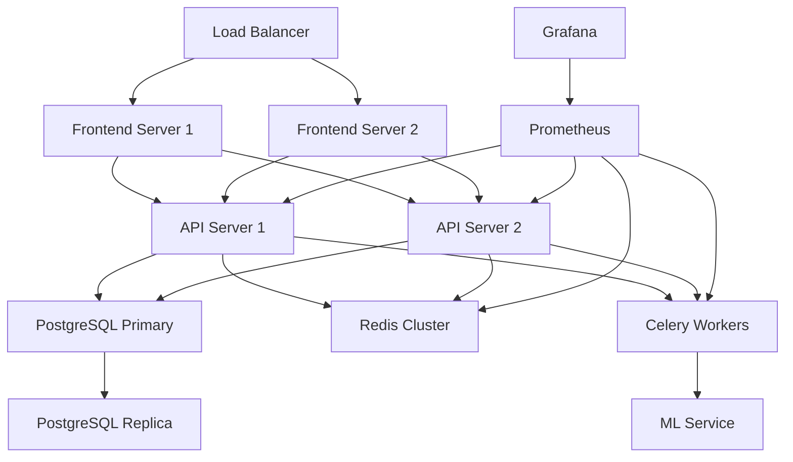

# DevOps Documentation

## Infrastructure Overview

### Architecture Diagram



## Infrastructure Components

### Production Environment

1. **Load Balancer**
   - Nginx with SSL termination
   - Rate limiting
   - DDoS protection
   - Health checks

2. **Application Servers**
   - Frontend: Next.js on Node.js
   - Backend: Django on Gunicorn
   - Worker: Celery
   - ML Service: Flask

3. **Databases**
   - PostgreSQL 14 with replication
   - Redis 6 cluster
   - MLflow tracking server

4. **Monitoring**
   - Prometheus
   - Grafana
   - ELK Stack
   - Sentry

### Development Environment

1. **Local Setup**
   ```bash
   # Clone repository
   git clone https://github.com/yourusername/churn-prediction.git
   cd churn-prediction

   # Start development environment
   docker-compose -f docker-compose.dev.yml up
   ```

2. **CI/CD Environment**
   - GitHub Actions runners
   - Test databases
   - Staging environment

## Deployment

### Production Deployment

1. **Prerequisites**
   ```bash
   # Install required tools
   apt-get update
   apt-get install -y docker.io docker-compose nginx certbot
   ```

2. **SSL Certificate**
   ```bash
   # Generate SSL certificate
   certbot certonly --nginx -d yourdomain.com
   ```

3. **Environment Setup**
   ```bash
   # Create environment files
   cp .env.example .env
   vim .env  # Edit with production values

   # Create docker networks
   docker network create frontend-net
   docker network create backend-net
   ```

4. **Database Setup**
   ```bash
   # Initialize PostgreSQL
   docker-compose -f docker-compose.prod.yml run --rm backend python manage.py migrate
   docker-compose -f docker-compose.prod.yml run --rm backend python manage.py createsuperuser
   ```

5. **Start Services**
   ```bash
   # Start all services
   docker-compose -f docker-compose.prod.yml up -d

   # Scale workers
   docker-compose -f docker-compose.prod.yml up -d --scale celery-worker=3
   ```

### Rolling Updates

```bash
# Pull latest changes
git pull origin main

# Update dependencies
docker-compose -f docker-compose.prod.yml build

# Rolling update of services
docker-compose -f docker-compose.prod.yml up -d --no-deps --build backend
docker-compose -f docker-compose.prod.yml up -d --no-deps --build frontend
```

## Monitoring & Logging

### Prometheus Configuration

```yaml
# prometheus.yml
global:
  scrape_interval: 15s
  evaluation_interval: 15s

scrape_configs:
  - job_name: 'django'
    static_configs:
      - targets: ['backend:8000']

  - job_name: 'redis'
    static_configs:
      - targets: ['redis:6379']

  - job_name: 'celery'
    static_configs:
      - targets: ['celery-worker:8888']
```

### Grafana Dashboards

1. **System Metrics**
   - CPU Usage
   - Memory Usage
   - Disk I/O
   - Network Traffic

2. **Application Metrics**
   - Request Rate
   - Response Time
   - Error Rate
   - Active Users

3. **ML Metrics**
   - Prediction Latency
   - Model Accuracy
   - Feature Importance
   - Data Drift

### Log Management

```yaml
# fluentd.conf
<source>
  @type forward
  port 24224
  bind 0.0.0.0
</source>

<match **>
  @type elasticsearch
  host elasticsearch
  port 9200
  logstash_format true
</match>
```

## Backup & Recovery

### Database Backup

```bash
#!/bin/bash
# backup.sh

TIMESTAMP=$(date +"%Y%m%d_%H%M%S")
BACKUP_DIR="/backups/postgres"

# Backup PostgreSQL
docker-compose exec -T db pg_dump -U postgres churn_prediction > \
    "$BACKUP_DIR/db_backup_$TIMESTAMP.sql"

# Compress backup
gzip "$BACKUP_DIR/db_backup_$TIMESTAMP.sql"

# Cleanup old backups (keep last 7 days)
find "$BACKUP_DIR" -name "db_backup_*.sql.gz" -mtime +7 -delete
```

### Model Artifacts Backup

```bash
#!/bin/bash
# backup_models.sh

TIMESTAMP=$(date +"%Y%m%d_%H%M%S")
BACKUP_DIR="/backups/models"

# Backup model artifacts
tar -czf "$BACKUP_DIR/models_backup_$TIMESTAMP.tar.gz" \
    -C /app/models .

# Cleanup old backups (keep last 5 versions)
ls -t "$BACKUP_DIR"/models_backup_*.tar.gz | tail -n +6 | xargs -r rm
```

## Scaling

### Horizontal Scaling

```bash
# Scale API servers
docker service scale churn_prediction_backend=3

# Scale workers
docker service scale churn_prediction_celery=5

# Scale frontend
docker service scale churn_prediction_frontend=2
```

### Vertical Scaling

```yaml
# docker-compose.prod.yml
services:
  backend:
    deploy:
      resources:
        limits:
          cpus: '2'
          memory: 4G
        reservations:
          cpus: '1'
          memory: 2G
```

## Security

### Network Security

1. **Firewall Rules**
   ```bash
   # Allow only necessary ports
   ufw allow 80/tcp
   ufw allow 443/tcp
   ufw allow from 10.0.0.0/8 to any port 5432  # PostgreSQL
   ufw allow from 10.0.0.0/8 to any port 6379  # Redis
   ```

2. **VPC Configuration**
   - Private subnets for databases
   - Public subnets for load balancers
   - NAT gateway for outbound traffic

### Access Control

1. **SSH Configuration**
   ```bash
   # Generate SSH key
   ssh-keygen -t ed25519 -C "devops@yourdomain.com"

   # Add to authorized keys
   cat ~/.ssh/id_ed25519.pub >> ~/.ssh/authorized_keys
   ```

2. **Bastion Host Setup**
   ```bash
   # Configure jump host
   Host bastion
       HostName bastion.yourdomain.com
       User ubuntu
       IdentityFile ~/.ssh/id_ed25519
   ```

## Disaster Recovery

### Recovery Procedures

1. **Database Failure**
   ```bash
   # Promote replica to primary
   docker-compose exec db2 pg_ctl promote

   # Update connection strings
   docker-compose exec backend python manage.py update_db_connection
   ```

2. **Service Failure**
   ```bash
   # Restart failed service
   docker-compose -f docker-compose.prod.yml up -d --force-recreate backend

   # Verify health
   curl -f http://localhost/health/
   ```

### High Availability

1. **Load Balancer Configuration**
   ```nginx
   upstream backend {
       server backend1:8000 max_fails=3 fail_timeout=30s;
       server backend2:8000 max_fails=3 fail_timeout=30s;
       server backend3:8000 max_fails=3 fail_timeout=30s;
   }
   ```

2. **Database Replication**
   ```bash
   # Configure streaming replication
   docker-compose exec db1 pg_basebackup -D /var/lib/postgresql/data -S replica1 -P -U replicator -R
   ```

## Performance Tuning

### Database Optimization

```sql
-- Add indexes for common queries
CREATE INDEX idx_customer_risk ON customer(risk_score);
CREATE INDEX idx_prediction_date ON risk_history(prediction_time);

-- Optimize vacuum settings
ALTER SYSTEM SET autovacuum_vacuum_scale_factor = 0.1;
ALTER SYSTEM SET autovacuum_analyze_scale_factor = 0.05;
```

### Cache Configuration

```python
# settings.py
CACHES = {
    'default': {
        'BACKEND': 'django_redis.cache.RedisCache',
        'LOCATION': 'redis://redis:6379/1',
        'OPTIONS': {
            'CLIENT_CLASS': 'django_redis.client.DefaultClient',
            'SOCKET_CONNECT_TIMEOUT': 5,
            'SOCKET_TIMEOUT': 5,
            'RETRY_ON_TIMEOUT': True,
            'MAX_CONNECTIONS': 1000,
            'COMPRESSOR': 'django_redis.compressors.zlib.ZlibCompressor',
        }
    }
}
```

## Maintenance

### Routine Tasks

1. **Log Rotation**
   ```bash
   # /etc/logrotate.d/docker
   /var/lib/docker/containers/*/*.log {
       rotate 7
       daily
       compress
       missingok
       delaycompress
       copytruncate
   }
   ```

2. **System Updates**
   ```bash
   # Update system packages
   apt-get update
   apt-get upgrade -y

   # Update Docker images
   docker-compose pull
   docker-compose up -d
   ```

### Monitoring Alerts

```yaml
# alertmanager.yml
route:
  group_by: ['alertname']
  group_wait: 30s
  group_interval: 5m
  repeat_interval: 1h
  receiver: 'team-emails'

receivers:
  - name: 'team-emails'
    email_configs:
      - to: 'team@yourdomain.com'
        from: 'alertmanager@yourdomain.com'
        smarthost: 'smtp.gmail.com:587'
        auth_username: 'alertmanager@yourdomain.com'
        auth_password: 'your-password'
``` 