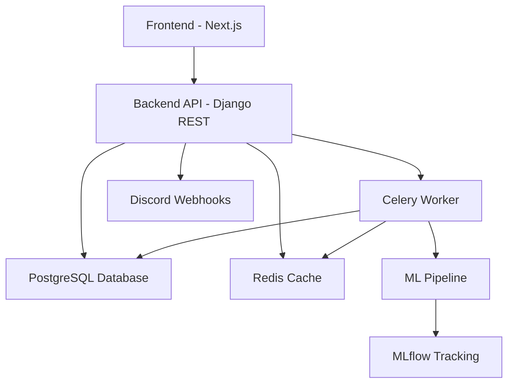
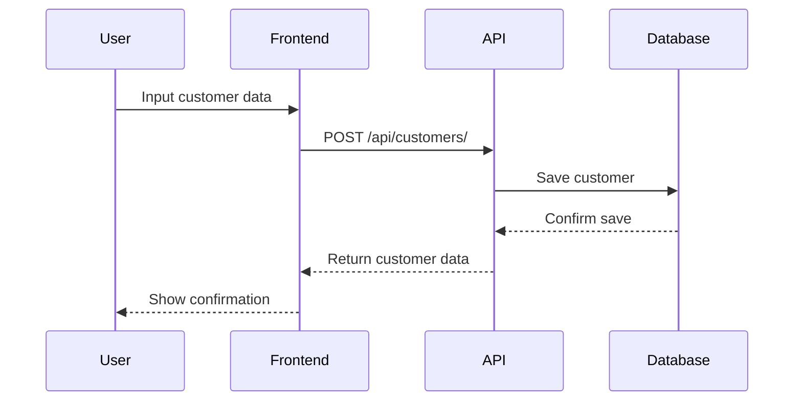
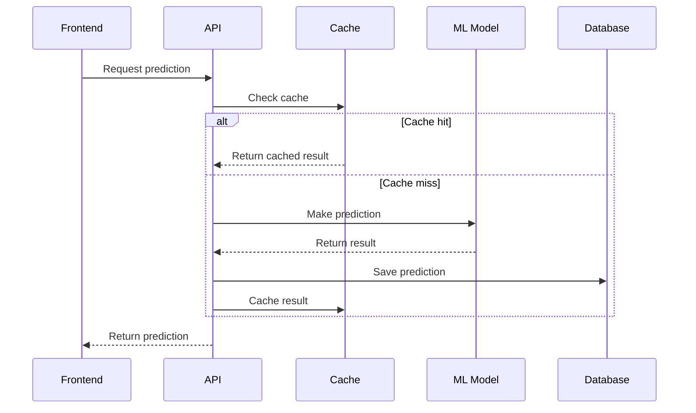
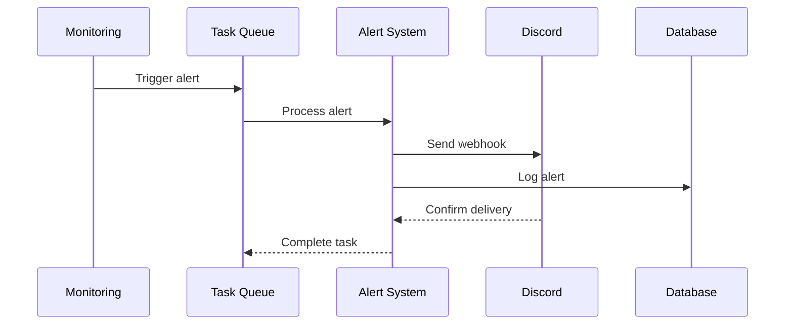

# Customer Churn Prediction System

## Overview
A sophisticated machine learning-powered system for predicting and monitoring customer churn risk in real-time, with automated alerts and comprehensive monitoring capabilities.

## Core Features

### 1. Machine Learning Pipeline
- **Churn Prediction Model**
  - Random Forest Classifier implementation
  - Feature engineering and preprocessing
  - Automated model training and evaluation
  - Model performance tracking via MLflow
  - Continuous model monitoring and retraining

### 2. Risk Monitoring System
- **Real-time Risk Assessment**
  - Customer risk score calculation
  - Historical risk tracking
  - Risk trend analysis
  - Risk distribution visualization
  - High-risk customer identification

### 3. Alert System
- **Discord Integration**
  - Real-time risk alerts
  - Configurable risk thresholds
  - Alert history tracking
  - Alert statistics dashboard
  - Rate-limited webhook calls

### 4. Customer Management
- **Data Management**
  - Customer profile management
  - Risk history tracking
  - Bulk operations support
  - CSV data import/export
  - Historical data analysis

## Technical Architecture

### Backend Stack
- **Framework**: Django REST Framework
- **Database**: PostgreSQL
- **Cache**: Redis
- **Task Queue**: Celery
- **ML Framework**: Scikit-learn
- **Monitoring**: MLflow

### Frontend Stack
- **Framework**: Next.js 13+
- **Language**: TypeScript
- **Styling**: Tailwind CSS
- **Components**: Shadcn UI
- **State Management**: React Hooks
- **API Integration**: Custom ApiService

## System Architecture



## Data Flow Architecture

### 1. Customer Data Flow


### 2. Prediction Flow


### 3. Alert Flow


## Database Schema

### 1. Customer Table
```sql
CREATE TABLE customer_churn (
    customer_id INTEGER PRIMARY KEY,
    row_number INTEGER,
    surname VARCHAR(50),
    credit_score INTEGER,
    geography VARCHAR(50),
    gender VARCHAR(10),
    age INTEGER,
    tenure INTEGER,
    balance DECIMAL(15,2),
    num_of_products INTEGER,
    has_cr_card BOOLEAN DEFAULT FALSE,
    is_active_member BOOLEAN DEFAULT FALSE,
    estimated_salary DECIMAL(15,2),
    exited BOOLEAN DEFAULT FALSE
);
```

### 2. Risk History Table
```sql
CREATE TABLE churn_risk_history (
    id BIGSERIAL PRIMARY KEY,
    customer_id INTEGER REFERENCES customer_churn(customer_id) ON DELETE CASCADE,
    timestamp TIMESTAMP WITH TIME ZONE DEFAULT CURRENT_TIMESTAMP,
    churn_probability FLOAT,
    previous_probability FLOAT NULL,
    risk_change FLOAT NULL,
    is_high_risk BOOLEAN DEFAULT FALSE,
    FOREIGN KEY (customer_id) REFERENCES customer_churn(customer_id)
);
```

### 3. Alert Configuration Table
```sql
CREATE TABLE alert_configuration (
    id BIGSERIAL PRIMARY KEY,
    webhook_url VARCHAR(500),
    is_enabled BOOLEAN DEFAULT TRUE,
    high_risk_threshold FLOAT DEFAULT 0.7,
    risk_increase_threshold FLOAT DEFAULT 20.0,
    created_at TIMESTAMP WITH TIME ZONE DEFAULT CURRENT_TIMESTAMP,
    updated_at TIMESTAMP WITH TIME ZONE DEFAULT CURRENT_TIMESTAMP
);
```

### 4. Alert History Table
```sql
CREATE TABLE alert_history (
    id BIGSERIAL PRIMARY KEY,
    customer_id INTEGER REFERENCES customer_churn(customer_id),
    alert_type VARCHAR(20) CHECK (alert_type IN ('HIGH_RISK', 'RISK_INCREASE', 'SUMMARY')),
    message JSONB,
    sent_at TIMESTAMP WITH TIME ZONE DEFAULT CURRENT_TIMESTAMP,
    was_sent BOOLEAN DEFAULT FALSE,
    error_message TEXT,
    FOREIGN KEY (customer_id) REFERENCES customer_churn(customer_id)
);
```

## Component Architecture

### 1. Frontend Components
```
src/
├── app/                 # Next.js app router pages
├── components/          
│   ├── ui/             # Reusable UI components
│   ├── customer/       # Customer management
│   ├── alerts/         # Alert system
│   └── risk/           # Risk monitoring
├── lib/                # Utilities and services
├── types/              # TypeScript definitions
└── styles/             # Global styles
```

### 2. Backend Components
```
churn_project/
├── churn_app/
│   ├── models.py       # Database models
│   ├── views.py        # API views
│   ├── urls.py         # URL routing
│   ├── tasks.py        # Celery tasks
│   ├── utils.py        # Utilities
│   └── management/     # Custom commands
├── ml/
│   ├── pipeline.py     # ML pipeline
│   └── model.py        # ML model
└── config/             # Project settings
```

### 3. ML Pipeline Components
```
ml_pipeline/
├── preprocessing/      # Data preprocessing
├── feature_engineering/# Feature creation
├── training/          # Model training
├── evaluation/        # Model evaluation
└── prediction/        # Prediction serving
```

## Security Architecture

### 1. Authentication Flow
- JWT token-based authentication
- Secure token storage
- Token refresh mechanism
- Session management

### 2. Authorization Layers
- Role-based access control
- Resource-level permissions
- API endpoint protection
- Admin-only routes

### 3. Data Security
- HTTPS encryption
- Input validation
- SQL injection prevention
- XSS protection
- Rate limiting

## Key Components

### 1. Data Models
- `CustomerChurn`: Core customer data and metrics
- `ChurnRiskHistory`: Risk prediction history
- `AlertConfiguration`: Alert system settings
- `AlertHistory`: Alert tracking and monitoring

### 2. API Endpoints
- `/api/customers/`: Customer management
- `/api/predict/`: Risk prediction
- `/api/alerts/config/`: Alert configuration
- `/api/alerts/history/`: Alert history
- `/api/risk/dashboard/`: Risk monitoring dashboard

### 3. ML Pipeline Components
- Data preprocessing and cleaning
- Feature engineering
- Model training and evaluation
- Prediction serving
- Performance monitoring

### 4. Frontend Features
- Interactive dashboards
- Risk visualization
- Alert management interface
- Customer management portal
- Real-time updates

## Security Features
- JWT authentication
- Role-based access control
- Rate limiting
- Secure webhook handling
- Input validation
- Error tracking

## Monitoring & Analytics
- Model performance metrics
- Risk distribution analysis
- Alert system statistics
- API performance monitoring
- Error rate tracking

## Current Version
**Version**: 1.0.0
- Full ML pipeline implementation
- Complete risk monitoring system
- Discord alert integration
- Customer management features
- Basic analytics dashboard

## Deployment
- Docker containerization
- PostgreSQL database setup
- Redis cache configuration
- Celery worker deployment
- MLflow server setup

## Performance Optimizations
- Database query optimization
- Caching implementation
- Background task processing
- Rate limiting
- Pagination support

## Documentation
- API documentation
- ML pipeline documentation
- Frontend implementation guide
- Deployment guide
- Contributing guidelines

## License
MIT License - See LICENSE file for details 